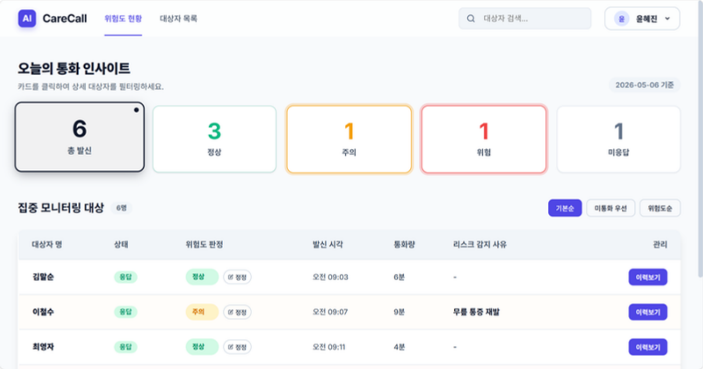
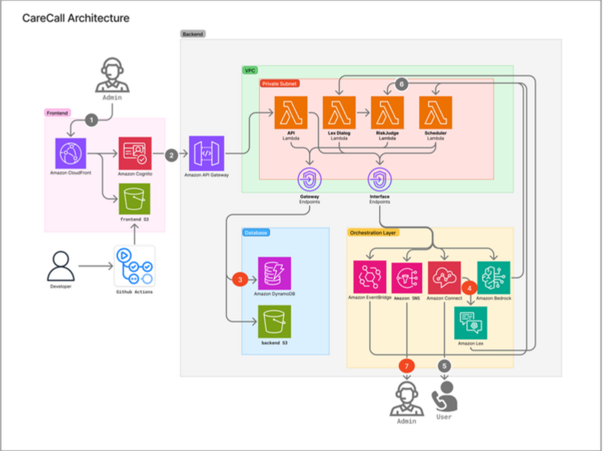
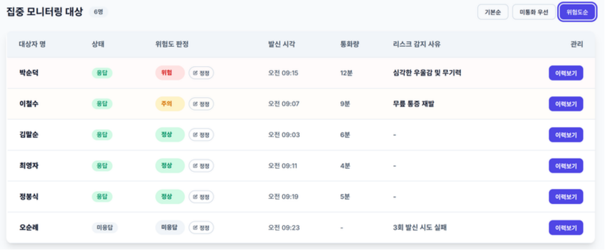
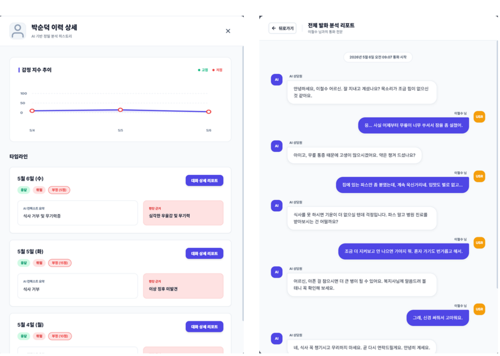

# CareCall

> 독거노인을 위한 AI 기반 안부 전화 및 위험 감지 서비스

CareCall은 독거노인에게 매일 정해진 시간에 자동으로 안부 전화를 걸고, 통화 내용을 AI로 분석해 정서적 이상 징후와 건강 위험 신호를 감지하는 클라우드 기반 돌봄 서비스입니다. 복지 담당자는 웹 대시보드에서 통화 현황, 위험도, 미응답 대상자, 상세 대화 리포트를 확인하고 고위험군을 우선적으로 관리할 수 있습니다.



## Overview

기존 독거노인 돌봄 방식은 수동 전화와 방문에 크게 의존해 인력 부담이 크고, ICT 센서 기반 서비스는 감정이나 언어 신호를 파악하기 어렵다는 한계가 있습니다. CareCall은 익숙한 전화 채널을 사용하면서도 자동 발신, 음성 인식, 감정 분석, 위험도 판단, 관리자 알림을 하나의 흐름으로 연결합니다.

### Key Features

- 매일 정해진 시간에 대상자별 자동 안부 전화 발신
- Amazon Lex 기반 음성 대화 및 통화 흐름 제어
- 통화 내용 STT 변환 후 감정, 키워드, 문맥 기반 위험도 분석
- 정상, 주의, 위험 3단계 위험도 분류 및 판단 근거 제공
- 위험 상황 감지 시 관리자에게 알림 전송
- 관리자 대시보드에서 통화 현황, 미응답 대상자, 위험군, 상세 이력 조회

## Architecture



CareCall은 정적 웹 대시보드, 서버리스 백엔드, AI 분석 파이프라인, 데이터 저장소로 구성됩니다. 관리자는 CloudFront로 배포된 프론트엔드에 접속하고, API Gateway를 통해 Lambda 기반 백엔드와 통신합니다. 자동 발신은 EventBridge Scheduler와 Amazon Connect가 담당하며, 통화 흐름은 Amazon Lex와 Lambda Code Hook으로 제어합니다. 통화 종료 후 Bedrock, Comprehend, 규칙 기반 로직을 조합해 최종 위험도를 판단하고 DynamoDB와 S3에 결과를 저장합니다.

### Flow

1. 관리자가 웹 대시보드에 접속해 대상자와 통화 현황을 확인합니다.
2. EventBridge Scheduler가 대상자별 발신 시간에 Lambda를 트리거합니다.
3. Lambda가 Amazon Connect를 통해 대상자에게 전화를 발신합니다.
4. Amazon Lex가 음성 대화를 진행하고 응답을 텍스트로 변환합니다.
5. RiskJudge Lambda가 키워드, 감정, 문맥을 분석해 위험도를 산정합니다.
6. 분석 결과와 통화 기록은 DynamoDB와 S3에 저장됩니다.
7. 위험 단계가 높으면 SNS/Email을 통해 관리자에게 알림을 보냅니다.

## Tech Stack

| Area | Stack |
| --- | --- |
| Frontend | React, TypeScript, Amazon S3, Amazon CloudFront |
| Backend | Amazon API Gateway, AWS Lambda, Amazon EventBridge, Amazon Connect |
| AI | Amazon Lex, Amazon Bedrock, Amazon Comprehend |
| Database & Storage | Amazon DynamoDB, Amazon S3 |
| Network & Security | VPC, Private Subnet, VPC Endpoint, Amazon Cognito |
| DevOps & Tools | GitHub Actions, Git/GitHub, Postman, Notion |

## Screenshots

### Risk Dashboard

통화 수, 정상/주의/위험 대상자 수, 미응답 현황을 한 화면에서 확인하고 대상자별 상세 이력으로 이동할 수 있습니다.


### Priority Sorting

관리자는 미통화 우선 또는 위험도순으로 대상자를 정렬해 긴급 대응이 필요한 대상을 빠르게 찾을 수 있습니다.



### AI Analysis Report

대상자별 감정 지수 추이, 통화 요약, 판단 근거, 전체 발화 내용을 확인해 AI 판정 결과를 검토할 수 있습니다.



## Result

- 위험 상황 탐지 정확도: 87.5% (24건 중 21건 일치)
- 위험 시나리오 탐지 정확도: 100%
- 안부 전화 성공률: 91.7% (24건 중 22건 유의미한 응답 기준 충족)
- 평균 처리 시간: 약 6.2초
- 예상 운영 비용: 20명 기준 월 약 10달러

## Team

CareCall은 클라우드 컴퓨팅 프로젝트로, 프론트엔드 대시보드, 서버리스 백엔드, AI 위험도 분석, 통화 자동화, 데이터 저장 구조를 역할별로 나누어 구현했습니다.

---

# CareCall Cloud Backend Notes

CareCall AWS backend repository. The current runtime source of truth is the
Lambda-console implementation in `lambda-console/`. The SAM files under `src/`
and `template.yaml` remain as an earlier scaffold/reference unless we decide to
revive SAM deployment explicitly.

## Repository Layout

```text
.
|-- lambda-console/   # Current AWS Lambda handler sources
|-- openapi/          # Swagger/OpenAPI specs shared with frontend
|-- events/           # Local/SAM sample events for scaffold handlers
|-- docs/             # Amazon Connect setup and contact-flow notes
|-- src/              # Earlier SAM scaffold handlers
`-- template.yaml     # Earlier SAM template
```

## Runtime Model

- Runtime: Python 3.12 for Lambda functions.
- Deployment style: Lambda console copy/upload is the current operational path.
- API Gateway: REST API with Lambda proxy integration.
- Frontend origin: `https://d29gc62aprgiim.cloudfront.net`.
- CORS: Lambda responses should include CORS headers, and API Gateway should
  also expose OPTIONS plus gateway responses for auth/4XX/5XX failures.

## Main Call Flow

- Amazon Connect 세팅 체크리스트: [docs/amazon-connect-setup.md](docs/amazon-connect-setup.md)
- Contact Flow 설계안: [docs/contact-flow-design.md](docs/contact-flow-design.md)

1. `start_outbound_call_lambda.py` is invoked manually or by EventBridge
   Scheduler.
2. The scheduler checks enabled recipients, matches `autoCallTime` against the
   current KST time, creates a pending call-history item, and starts an Amazon
   Connect outbound call.
3. Amazon Connect routes user speech into Lex. `lex_dialog_bedrock_hook.py`
   receives `inputTranscript`, calls Bedrock, and returns the next response or
   early-closing action.
4. At the end of the call, `riskjudge_bedrock_lambda.py` judges risk with
   Bedrock, writes summary/risk metadata to DynamoDB, updates user-level
   `lastRiskLevel` and `next_opening_question`, and sends SNS for danger cases.
5. Dashboard APIs read recipients, today's status, call history, corrections,
   and recording playback URLs.

## Lambda Console Functions

| File | Purpose |
| --- | --- |
| `fetch_recipients_lambda.py` | `GET /api/recipients` |
| `post_recipient_lambda.py` | `POST /api/recipients` |
| `update_recipient_lambda.py` | `PUT /api/recipients/{recipientId}` and `DELETE /api/recipients/{recipientId}` |
| `fetch_today_call_status_lambda.py` | `GET /api/calls/today?date=YYYY-MM-DD` |
| `fetch_call_history_lambda.py` | `GET /api/calls/history/{recipientName}` |
| `post_call_correction_lambda.py` | `POST /api/calls/{contactId}/correction` |
| `fetch_correction_stats_lambda.py` | `GET /api/calls/corrections/stats?day=YYYY-MM-DD` |
| `get_recording_presigned_url_lambda.py` | `GET /api/recordings/url?bucket=...&key=...&download=true` |
| `start_outbound_call_lambda.py` | EventBridge/manual outbound-call scheduler |
| `lex_dialog_bedrock_hook.py` | Lex dialog code hook backed by Bedrock |
| `riskjudge_bedrock_lambda.py` | Final risk judge, DynamoDB update, SNS alert |
| `transcribe_s3_recording_lambda.py` | S3 recording event to Transcribe job |

## Data Model

### Users Table

Typical table: `carecall-users-dev`.

Important fields:

- `recipientId`
- `recipientName`
- `phoneNumber`
- `address`
- `memo`
- `autoCallTime`
- `autoCallEnabled`
- `lastRiskLevel`
- `next_opening_question`

### Call History Table

Typical table: `carecall-call-history-dev`.

Important fields:

- `session_id`
- `contactId`
- `recipientId`
- `recipientName`
- `phoneNumber`
- `callTime`
- `createdAt`
- `status`
- `conversation`
- `summary`
- `riskLevel`
- `riskReason`
- `riskScore`
- `sentiment`
- `sentimentScore`
- `recording_s3_bucket`
- `recording_s3_key`
- `transcript_s3_bucket`
- `transcript_s3_key`

Dashboard responses expose recording metadata as `recordingS3Bucket` and
`recordingS3Key`.

### Corrections Table

Typical table: `carecall-call-corrections-dev`.

Important fields:

- `correctionId`
- `contactId`
- `originalRiskLevel`
- `correctedRiskLevel`
- `reason`
- `correctedAt`
- `correctedDate`

Correction creation stores a correction item and also synchronizes the related
call-history risk fields and the user's `lastRiskLevel`.

## DynamoDB Indexes

Recommended indexes used by the Lambda handlers:

| Table | Index | Key intent |
| --- | --- | --- |
| Users | recipient/status index if configured | Faster scheduler recipient lookup |
| Call History | `ByDateIndex` | Today's call-status lookup by `createdAt` |
| Call History | `RecipientNameIndex` | Recipient history lookup by `recipientName` |
| Call History | `RecipientIdIndex` | Rename synchronization by `recipientId` |
| Call History | `ContactIdIndex` | Correction lookup by `contactId` |
| Corrections | `CorrectionsByDateIndex` | Correction stats lookup by `correctedDate` |

Several handlers intentionally fall back to scan when an expected index is not
available, but production tables should use the indexes above for predictable
latency.

## Recording Download URL

The recording URL flow is key-based:

1. `fetch_today_call_status_lambda.py` and `fetch_call_history_lambda.py` return
   `recordingS3Bucket` and `recordingS3Key`.
2. Frontend calls
   `/api/recordings/url?bucket=<bucket>&key=<recording-key>&download=true`.
3. `get_recording_presigned_url_lambda.py` validates the bucket/key and returns
   a short-lived S3 presigned URL.

Required Lambda/IAM permission:

```text
s3:GetObject on the recording bucket/key prefix
```

Security-related environment variables:

- `RECORDINGS_BUCKET`
- `ALLOWED_BUCKETS`
- `RECORDING_KEY_PREFIX`
- `PRESIGNED_URL_EXPIRES`

## CORS Notes

Each Lambda proxy response should include:

```text
Access-Control-Allow-Origin: https://d29gc62aprgiim.cloudfront.net
Access-Control-Allow-Headers: Content-Type,X-Amz-Date,Authorization,X-Api-Key,X-Amz-Security-Token
Access-Control-Allow-Methods: GET,POST,PATCH,PUT,DELETE,OPTIONS
```

For API Gateway REST API, Lambda headers alone are not enough for every failure
path. Configure:

- OPTIONS method for each browser-facing route.
- Gateway Responses such as `DEFAULT_4XX`, `DEFAULT_5XX`, `UNAUTHORIZED`, and
  `ACCESS_DENIED` with matching CORS headers.
- Lambda invoke permission for every connected method.

## OpenAPI Specs

- `openapi/carecall-api-recipient-recording.yaml`: current recipient delete and
  recording URL spec plus recording metadata additions for today/history APIs.
- `openapi/carecall-api-3.yaml`: correction and statistics related spec.
- `openapi/carecall-api.yaml`: older broad API reference.

When an API shape changes, update the matching OpenAPI file in the same feature
commit.

## SnapStart Guidance

SnapStart is available for supported managed runtimes including Python 3.12+.
The best candidates in this repository are the Bedrock-heavy handlers:

- `lex_dialog_bedrock_hook.py`
- `riskjudge_bedrock_lambda.py`

Apply SnapStart to published versions/aliases and connect Amazon Connect or Lex
integrations to the alias ARN, not `$LATEST`. After enabling it, run Lambda
console tests and one real Connect/Lex flow because snapshot/restore can expose
init-time assumptions in SDK clients, secrets, timestamps, or network state.

## Local Validation

Basic syntax checks:

```powershell
python -m py_compile lambda-console/fetch_recipients_lambda.py
python -m py_compile lambda-console/fetch_today_call_status_lambda.py
python -m py_compile lambda-console/fetch_call_history_lambda.py
python -m py_compile lambda-console/post_call_correction_lambda.py
python -m py_compile lambda-console/get_recording_presigned_url_lambda.py
```

For AWS behavior, prefer Lambda console test events plus CloudWatch logs because
the deployed path is currently Lambda console/API Gateway rather than local SAM.

## Operational Notes

- `autoCallEnabled` is stored as boolean `true` or `false`.
- Recipient rename synchronization is handled in `update_recipient_lambda.py`
  when `recipientName` changes.
- Recipient delete removes only the user-table item; call-history records are
  intentionally preserved.
- Correction stats count correction-table records for the requested date.
- SNS danger alerts are sent by `riskjudge_bedrock_lambda.py` when the judged
  risk level reaches the configured danger condition.
